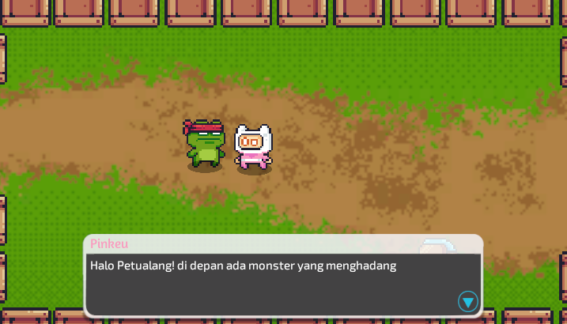

# Turn-Based JRPG Battle Demo

<table>
  <tr>
    <td align="center">
       
      <b>Dialog</b>
    </td>
    <td align="center">
       
      <b>Battle</b>
    </td>
  </tr>
</table>

A turn-based JRPG prototype developed in **Unity**, featuring exploration, NPC interaction, a party-based battle system, and story-driven cutscenes. This project focuses on building a modular gameplay architecture while keeping the gameplay simple and easy to expand.

## Features

### Exploration
- Player movement
- NPC interaction using Fungus
- Story progression
- Timeline cutscenes

### Battle System
- Turn-based combat
- Multiple playable characters
- Skill system
- Single-target and ally-target skills
- Buff and healing skills
- Battle UI
- Win / Defeat flow

### Technical Features
- State Machine
- Event-driven architecture
- ScriptableObject-based skill system
- Timeline integration
- LeanTween UI animations
- Object-oriented architecture
- Clean and maintainable code structure

## Controls

### Exploration
- **WASD** - Move
- **Space** - Interact

### Battle
- **Mouse** - Select skills
- **Space / Left Click** - Continue after Victory or Defeat

## Third-Party Assets

This project uses several third-party assets:

- Fungus (Dialogue System)
- LeanTween

Visual, audio, and UI assets are used for demonstration purposes.

## Unity Version

Unity 2022 LTS

## Author

**Ilham Jalu Prakosa**

Game Programmer | Unity Developer
